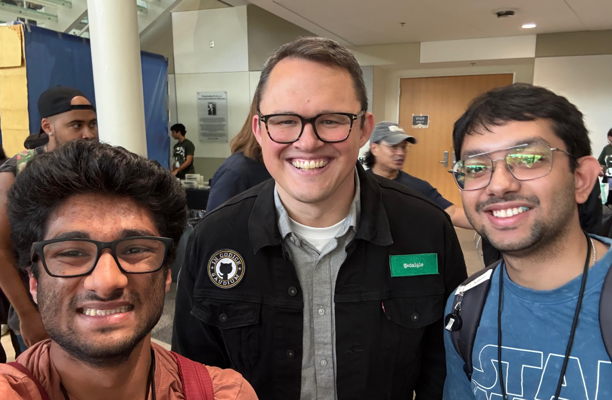

<h1 align="center">Hi 👋, I'm Ritam Mukherjee</h1>
<h3 align="center">Your friendly Neighbourhood Programmer 🕷️🕸️ </h3>

<!-- 
  
 -->

<!-- - 🔭 I’m currently working on [JesPie](https://github.com/RitamCODE/JesPie)-->

<!-- - 🌱 I’m currently exploring **Generative AI, Deep Learning and Large Language Modela**-->

<!-- - 👯 I’m looking to collaborate on [JesPie](https://github.com/RitamCODE/JesPie)-->

<!-- - 👨‍💻 All of my projects are available at [GitHub](https://github.com/RitamCODE)-->

<!-- - 💬 Ask me about **Python, ML, Generative AI, LangChain, Vector Databases**-->
  
<!-- - 📫 Reach me at **ritam.stallion27@gmail.com**-->

<!--⚡ Fun fact **Besides being a developer I am also a Indian Classical Flaustist and Painter**-->

<h3 align="left">Connect with me:</h3>

    

<h3 align="left">Languages and Tools:</h3>

<!-- added hacktoberfest badges login to holopin account to see those https://www.holopin.io/@ritamcode# -->

<!-- 

  
 -->

  Prized possesion 😅 - Photo with <a href="https://github.com/kdaigle">@kdaigle</a> (COO, GitHub) and dearest Abhiram <a href="https://github.com/abhiram2504">@abhiram2504 </a> 

<!--
&nbsp;

 -->

